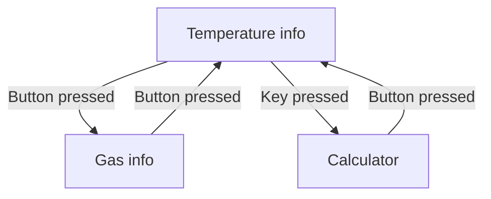

# ArduinoProject

I started to make this project because i wanted to see if i like the hardware part and if embedded development is for me.

This project was made to practice my skills learned on Arduino, firstly the project has 3 states:

1. Info about temperature and humidity
2. Calculator app
3. A animation

Now the last part was removed and was replaced with information about the gas in the air.

The scheme with the 3 states and how you can switch between them.
